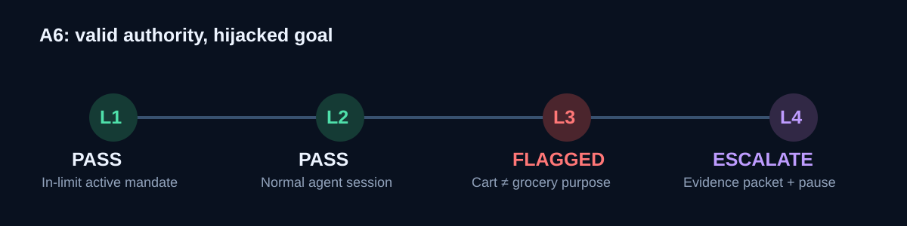

# Agent Transaction Risk Layer

> **A merchant-side risk system for AI-agent payments that detects when a valid delegated mandate has been used for the wrong goal.**

## Why this matters

Agentic checkout protocols intentionally leave merchant fraud modelling outside their scope: the Agentic Checkout RFC names PSP authorization/capture and fraud-model details as out of scope, while keeping orders and payments on merchant systems. [ACP Agentic Checkout RFC](https://github.com/agentic-commerce-protocol/agentic-commerce-protocol/blob/main/rfcs/rfc.agentic_checkout.md)

That creates a hard inversion for legacy fraud controls. Device, IP, clickstream, and behavioural signals often describe the agent—not its human principal—so legitimate automation can look bot-like while a hijacked agent can execute a perfectly normal session. The operational consequence is a choice between false positives and losses: a 500-leader fraud/risk/security survey reports difficulty distinguishing legitimate from malicious automation and identifies unclear liability as an agentic-commerce risk. [Darwinium’s 500-leader survey](https://www.darwinium.com/navigating-agentic-commerce-2026-report)

The novel failure is **indirect prompt injection**: an agent reads attacker-controlled instructions in external content, then performs an action unrelated to its original task. INJECAGENT evaluates 1,054 cases across 17 user tools and reports tool-integrated agents can be manipulated into harmful actions, including financial ones. [INJECAGENT research](https://aclanthology.org/2024.findings-acl.624/)

This project answers four distinct questions: **was it authorized, did the session behave normally, did the outcome still match the user’s purpose, and what evidence supports the response?**

## Architecture

```text
Agent session + cart + delegated mandate + prior history
                         │
                         ▼
┌─────────────────────────────────────────────────────────────────────────┐
│ L1  Mandate verifier — amount, category, time, lifecycle, identity      │
│     pass/fail JSON reason trail                                           │
└──────────────────────────┬──────────────────────────────────────────────┘
                           ▼
┌─────────────────────────────────────────────────────────────────────────┐
│ L2  Behaviour detector — sequence, timing, token reuse, velocity        │
│     risk score + contributing features                                    │
└──────────────────────────┬──────────────────────────────────────────────┘
                           ▼
┌─────────────────────────────────────────────────────────────────────────┐
│ L3  Intent integrity — purpose/cart divergence, injection structures,   │
│     beneficiary novelty + high-value + timing escalation                 │
└──────────────────────────┬──────────────────────────────────────────────┘
                           ▼
┌─────────────────────────────────────────────────────────────────────────┐
│ L4  Evidence + action — deterministic liability, evidence packet,       │
│     grounded narrative, step-up or mandate pause, Razorpay dispute flow  │
└─────────────────────────────────────────────────────────────────────────┘
```

See [ARCHITECTURE.md](ARCHITECTURE.md) for interfaces, precedence, and operational controls.

## Why a mandate represents delegated authority

Razorpay does not expose a first-class “AI agent” object. We deliberately model delegation with a mandate because it is a user-approved, scoped, revocable grant: it has an amount rule, permitted categories, timing, lifecycle, and identity context. Layer 1 therefore verifies **authority**, not intent. This is an explicit abstraction—not a claim that the payment API itself understands an agent’s goal—and Layer 3 covers the remaining gap.

## The A6 demo: valid authority, hijacked goal

The core demo is A6, an injected-intent transaction. Its mandate is active, amount in-limit, and session normal, but a cart such as `cryptocurrency voucher, luxury watch, gaming console` no longer matches a grocery purpose.



```bash
.venv/bin/python scripts/demo_a6_catch.py
.venv/bin/python scripts/demo_a6_evidence_packet.py
```

The browser console shows the same case as its first row: **L1 pass · L2 pass · L3 flagged · L4 escalate-to-provider**, with the packet, Layer 3 evidence, and narrative drill-down.

## Measured results

All results use the frozen, mandate-disjoint held-out split. These are **synthetic-data results**, not production fraud rates.

| Layer / metric | Result |
|---|---:|
| L2 precision @ 0.5 | 67.19% |
| L2 recall @ 0.5 | 56.95% |
| L2 F1 @ 0.5 | 0.6165 |
| L2 PR-AUC | 0.6111 |
| L2 ROC-AUC | 0.8674 |
| L3 I1 on A6 — precision / recall | 100.00% / 65.22% |
| L3 I4 on A6 — precision / recall | 37.50% / 4.35% |

| Attack class | Held-out total | L2 caught | Catch rate |
|---|---:|---:|---:|
| A1 consent replay | 38 | 5 | 13.2% |
| A2 spoofed identity | 24 | 24 | 100.0% |
| A3 over ceiling | 57 | 57 | 100.0% |
| A4 off-window/revoked | 66 | 38 | 57.6% |
| A5 slow drain | 48 | 48 | 100.0% |
| A6 injected intent | 69 | 0 | 0.0%* |

\*Expected: A6 deliberately retains normal behavioural signatures; Layer 3 owns that residual risk. Full methodology: [Layer 2 evaluation](results/layer2_evaluation.md), [Layer 3 evaluation](results/layer3_evaluation.json), [simulator schema](docs/simulator.md).

## Quickstart

Requires Python 3.11+.

```bash
git clone <your-repository-url> razor
cd razor
python3 -m venv .venv
source .venv/bin/activate
pip install -r requirements.txt

cp .env.example .env
# Set Razorpay test credentials and change console credentials before sharing.

python scripts/demo_a6_evidence_packet.py
uvicorn main:app --reload
# Open http://localhost:8000; local demo login defaults to demo / demo.
```

The simulator is reproducible, but **do not regenerate or modify `results/holdout_split.json`** once evaluation has begun. Doing so invalidates the reported metrics. For a new experimental dataset only:

```bash
python -m simulator.run --seed 42 --output-dir simulator/data
python -m layer2_detector.train
python -m layer2_detector.evaluate
python -m layer3_intent.evaluate
```

Before promoting a replacement Layer 2 artifact, gate it on the same frozen holdout:

```bash
python scripts/check_layer2_regression.py path/to/candidate.joblib
```

### Razorpay test mode

Set `RAZORPAY_KEY_ID`, `RAZORPAY_KEY_SECRET`, and the bank-provisioned `RAZORPAY_TPAP_BASE_URL`. TPAP calls require account-specific UPI/device fields; the probe requires explicit test payload/IDs and reports unavailable endpoints honestly:

```bash
python scripts/test_razorpay_testmode.py
```

The console’s accept/contest and mandate controls call the same wrapper. A Layer 4 narrative uses an OpenAI Responses call only when `OPENAI_API_KEY` and `OPENAI_NARRATIVE_MODEL` are set; its prompt contains only packet fields and is retained for audit.

## Production-minded slice vs. roadmap

| Area | Implemented now | Designed / documented next |
|---|---|---|
| Secrets | Environment-only keys; committed `.env.example`; `.env` ignored | Vault/KMS rotation and least-privilege identities |
| Decisions | Structured Layer 1–4 trails and JSON decision events | Durable audit store and retention controls |
| Reliability | Local idempotency, retry/backoff, circuit breaker; fail-closed tests | Multi-region failover and live-dependency chaos |
| Safety | Step-up re-authorization; active-mandate pause guard; reviewer audit trail and notification queue | Human approval policies and delivery-provider integration |
| Model quality | Frozen split, regression gate, artifact metadata | Live drift dashboard and champion/challenger rollout |
| Adversarial coverage | Versioned SEO/hidden-text/payment-payload suite | Broader red-team and multilingual corpus |
| Compliance | Explicit minimization/scoped-design assumptions | Formal RBI/data-localization, PCI-DSS, legal mapping |

## Operational safeguards

The protected console/API sets response security headers, rejects production startup with the default demo credentials, applies separate read/action request limits, emits a request ID, and exposes an authenticated process-local metrics snapshot at `/v1/metrics`. The local audit store applies the configured retention window at startup. CI runs the complete test suite and the Layer 2 frozen-holdout regression gate; the local pre-commit hook runs the Layer 3 adversarial suite.

Incoming Razorpay events are accepted only through `/v1/webhooks/razorpay` after HMAC signature verification using `RAZORPAY_WEBHOOK_SECRET`. Audit writes form a per-merchant tamper-evident hash chain; production startup requires `AUDIT_HMAC_SECRET`, so a production audit record cannot silently fall back to an unkeyed hash.

The versioned API also supports real-time ingestion at `POST /v1/transactions/evaluate`: callers supply a transaction, mandate, prior transactions, session events, and a Layer 2 feature vector; it returns and audits the complete four-layer packet. Missing behavioural features fail closed rather than being guessed. Merchant administrators can inspect or tune bounded Layer 2/Layer 3 thresholds via authenticated `/v1/policies/current`; every policy update increments a version. A short screen-recording narration is ready in [docs/pitch-script.md](docs/pitch-script.md).

The console auto-refreshes every five seconds and provides search/filtering, A6 guided replay, timeline and provenance drill-downs, review capture, confirmed Razorpay actions, evidence JSON export/print-to-PDF, policy controls, and system-health context. This is intentionally polling-based for reliable local demos; production should use an authenticated event stream and durable broker.

Operational response procedures are in [docs/runbook.md](docs/runbook.md) and [docs/incident-response.md](docs/incident-response.md). The new Population Stability Index (PSI) gate gives a reproducible drift check before promotion; it is not a substitute for real-traffic monitoring:

```bash
python scripts/check_feature_drift.py baseline_features.csv candidate_features.csv
```

## Honest limitations

- The simulator encodes the taxonomy; its results show synthetic separation, not real-world fraud-loss reduction.
- I1 uses a lightweight offline TF-IDF/domain-concept embedder for reproducibility. It needs merchant-catalog language, human-reviewed labels, and calibration before policy use.
- I3 is a regression net, not a complete prompt-injection defence; attackers can paraphrase, encode, or stage attacks over turns.
- Layer 2 does not catch A6 by design. The full system must be evaluated jointly on consented real traffic with known outcomes and false-positive costs.
- API rate limiting and metrics are process-local controls for the demo. A multi-instance deployment needs a shared rate-limit store, durable metrics backend, and monitoring/alerting.
- Local audit retention is a defensible demo mechanism, not a formal data-retention or deletion guarantee.
- The ingestion endpoint requires a trustworthy feature-extraction service upstream. In production, it should receive signed event streams and derive Layer 2 features server-side rather than accept feature vectors from an untrusted browser/client.
- Razorpay TPAP availability and required fields are account/bank provisioned. Live test-mode actions depend on provisioned credentials, UPI/device payloads, and a test dispute.
- Liability labels are operational routing recommendations, not legal determinations.

## What’s next

1. Validate thresholds and Layer 3 signals on consented merchant traffic with blinded review labels.
2. Calibrate I2 domain reputation against a production source-intelligence feed.
3. Persist packets and metrics; expose drift, alert quality, and review outcomes in the console.
4. Complete real Razorpay test-mode probes and introduce human approval for irreversible actions.
5. Expand the adversarial corpus and run it in CI on every Layer 3 change.

## Repository map

`layer1_verifier/` deterministic scope checks · `layer2_detector/` behavioural ML · `layer3_intent/` goal-integrity checks · `layer4_evidence/` packets/actions · `integrations/razorpay/` API wrapper · `console/` protected UI · `tests/` unit, adversarial, and chaos suites.
